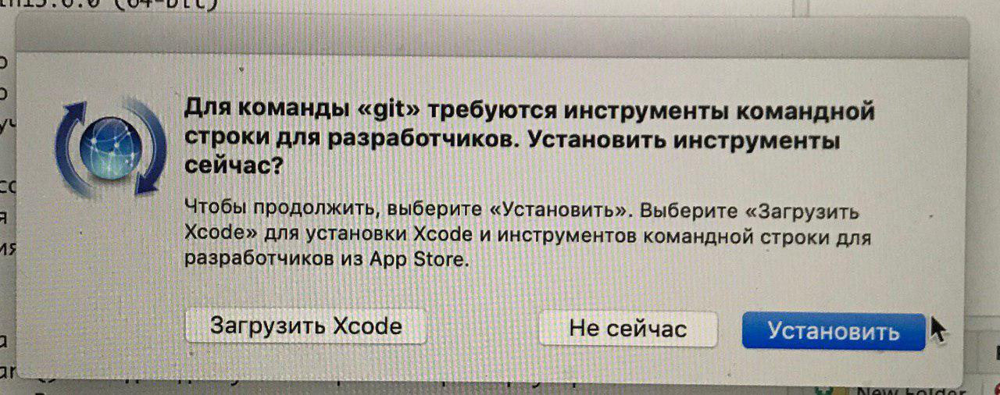

# Пошаговая установка R для windows

1. Если Windows только-только поставлена, то, пожалуйста,
создайте пользователя с логином английскими буквами и работайте из под него.

Например, имя пользователя "Mashenka" подходит, а "Машенька" не подходит.
Английское имя сильно облегчит жизнь в дальнейшем :)
Проблема в том, что при взаимодействии Rstudio - R могут возникать проблемы,
если в названии папки есть русские буквы, а у "Машеньки" путь к документам выглядит как "C:/Users/Машенька/".

Если компьютер давно используется с логином русскими буквами ("Машенька"), то оставляйте как есть, но:

    При установке внимательно следите, что все программы ставятся в папки не содержащие русских букв. Мы рекомендуем поставить R в папку `C:/R`, а Rstudio в папку `C:/Rstudio`.

2. На время установки отключите антивирус.

Нет, мы не хотим подсунуть слушателям хитрый троянский вирус :) Просто встречались с проблемами при установке, если антивирус включён.

3. Установите классический R для [windows](https://cran.r-project.org/bin/windows/base/).

Тем, кто уже знаком с R и **не боится повозиться самостоятельно**, мы советуем попробовать вместо классического R поставить MRO, [Microsoft R Open](https://mran.microsoft.com/open/).
Это другой дистрибутив R, оптимизированный под работу с 64-битными процессорами.
Всё полностью идентично, кроме двух нюансов: во-первых, MRO немного быстрее,
во-вторых, MRO ставит все пакеты на единую дату, выбираемую пользователем, а классический R ставит самые свежие версии пакетов.

4. Установите [RStudio](https://www.rstudio.com/products/rstudio/download/#download).

Rstudio — это всего лишь удобная красивая графическая оболочка к R.
Суровые брутальные программисты могут вполне обойтись и без Rstudio :)
Не спутайте Rstudio с R-studio, платной программой для восстановления данных.

5. Настройте Rstudio.

Запустите RStudio. Зайдите в раздел Tools — Global options.

В разделе General:

    * уберите галочку у Restore .Rdata into workspace in startup.
    * выберите `Never` у Save workspace to .Rdata on exit


В разделе Sweave:

    * "Weave .Rnw files using" выберите knitr.


В разделе Code - Diagnostics:

    * выставьте все галочки.


6. Установите свежую версию [Rtools](https://cran.r-project.org/bin/windows/Rtools/).

Это дополнительные программы, которые позволяют нам, в частности, из R создавать экселевские файлы.

7. Шаг только для windows. Если имя пользователя windows набрано русскими буквами, а создавать нового никак не хочется!

7.1. Создайте папку для установки пакетов без русских букв и пробелов, например, `C:/Rlib`.

7.2. Создайте папку для временных файлов без русских букв и пробелов, например, `C:/Temp`.

7.3. Выполните в консоли Rstudio команду
```{r, eval=FALSE}
system("setx R_LIBS C:/Rlib")
system("setx TEMP C:/Temp")
system("setx TMP C:/Temp")
```

Вместо `C:/Rlib` должно быть имя папки созданной для установки пакетов.

Вместо `C:/Temp` должно быть имя папки созданной для временных файлов.

7.4. Перезапустите Rstudio

7.5. Проверьте, что R знает, куда ему ставить пакеты. Для этого выполните в консоли Rstudio команду

```{r, eval=FALSE}
.libPaths()
```

Она должна указать путь к папке `C:/Rlib`. После этого все пакеты будут ставиться в папку `C:/Rlib`.


8. Установите все необходимые для курса пакеты R.

Скачайте файл [install_all.R](https://github.com/bdemeshev/coursera_metrics/raw/master/install_all.R).
Откройте его в RStudio (`File` — `Open file`). 

Если русские буквы видны как кракозябры, то после открытия файла выберите `File` — `Reopen with Encoding...` — `UTF-8` и
отметьте внизу галочку `Set as default for source files`. 

Запустите скрипт, инсталлирующий пакеты, выбрав `Code` — `Source with Echo`. При этом требуется соединение с Интернетом.

При установке может встретиться вопрос: "Do you want to install from sources the packages which need compilation?" 


Следует ответить "Нет"! 

Причина: некоторые пакеты содержат код C++ и для установки из исходников (source) требуют наличия и корректной настройки компилятора C++ на компьютере. При ответе "Нет" будут скачаны уже заранее скомпилированые пакеты. 

Бегущие красные надписи не означают ошибок, признаком ошибки является только явное сообщение Error.

9. Не забудьте включить обратно антивирус :)

<!-- 
переписать инструкцию, чтобы настраивать временную папку из командной строки Windows,
а не из Rstudio, тк он может не запускаться из-за неанглийских букв в папке для временных файлов!
-->


# Пошаговая установка R для macos 

1. Установите классический R для [macos](https://cran.r-project.org/bin/macosx/).

Тем, кто уже хорошо знаком с R и **не боится повозиться самостоятельно**, мы советуем попробовать вместо классического R поставить MRO, [Microsoft R Open](https://mran.microsoft.com/open/).
Это другой дистрибутив R, оптимизированный под работу с 64-битными процессорами.
Всё полностью идентично, кроме двух нюансов: во-первых, MRO немного быстрее,
во-вторых, MRO ставит все пакеты на единую дату, выбираемую пользователем, а классический R ставит самые свежие версии пакетов.

2. Установите [RStudio](https://www.rstudio.com/products/rstudio/download/#download).

Rstudio — это всего лишь удобная красивая графическая оболочка к R.
Суровые брутальные программисты могут вполне обойтись и без Rstudio :)
Не спутайте Rstudio с R-studio, платной программой для восстановления данных.

3. Запустите RStudio. 

При первом запуске Rstudio может появится сообщение о необходимости установки Xcode command line tools (инструменты командной строки для разработчиков). Их нужно установить. 



4. Настройте Rstudio. Зайдите в раздел Tools — Global options.

В разделе General:

    * уберите галочку у Restore .Rdata into workspace in startup.
    * выберите `Never` у Save workspace to .Rdata on exit


В разделе Sweave:

    * "Weave .Rnw files using" выберите knitr.


В разделе Code - Diagnostics:

    * выставьте все галочки.


5. Шаг только для Macos. Выполните в консоли Rstudio команду

```{r, eval=FALSE}
system("defaults write org.R-project.R force.LANG en_US.UTF-8")
```

Это позволит избежать потенциальных проблем с изображением кириллицы на компьютерах, где не срабатывает автоматическое определение настроек.


6. Установите все необходимые для курса пакеты R.


Скачайте файл [install_all.R](https://github.com/bdemeshev/coursera_metrics/raw/master/install_all.R).
Откройте его в RStudio (`File` — `Open file`). Запустите, выбрав `Code` — `Source with Echo`.
При этом требуется соединение с Интернетом.

При установке может встретиться вопрос: "Do you want to install from sources the packages which need compilation?" 


Следует ответить "Нет"! 

Причина: некоторые пакеты содержат код C++ и для установки из исходников (source) требуют наличия и корректной настройки компилятора C++ на компьютере. При ответе "Нет" будут скачаны уже заранее скомпилированые пакеты. 


Бегущие красные надписи не означают ошибок, признаком ошибки является только явное сообщение Error.

# Пошаговая установка R для linux (на примере Ubuntu)

1. Добавьте официальный репозиторий R:

```{bash, eval=FALSE}
sudo apt-key adv --keyserver keyserver.ubuntu.com --recv-keys E298A3A825C0D65DFD57CBB651716619E084DAB9
sudo add-apt-repository 'deb https://cloud.r-project.org/bin/linux/ubuntu bionic-cran35/'
sudo apt update
```

Вместо `bionic` (для 18.04) должно быть кодовое название версии Ubuntu (disco для 19.04)

2. Установите классический R:
```{bash, eval=FALSE}
sudo apt-get install r-base r-base-dev
```

3. Установите [RStudio](https://www.rstudio.com/products/rstudio/download/#download).

Rstudio — это всего лишь удобная красивая графическая оболочка к R.
Суровые брутальные программисты могут вполне обойтись и без Rstudio :)
Не спутайте Rstudio с R-studio, платной программой для восстановления данных.

4. Настройте Rstudio. 

Запустите RStudio. Зайдите в раздел Tools — Global options.

В разделе General:

    * уберите галочку у Restore .Rdata into workspace in startup.
    * выберите `Never` у Save workspace to .Rdata on exit


В разделе Sweave:

    * "Weave .Rnw files using" выберите knitr.


В разделе Code - Diagnostics:

    * выставьте все галочки.


5. Для пакетов R, скачивающих данные из Интернета, может потребоваться установка дополнительных библиотек linux

```{bash, eval=FALSE}
sudo apt-get install libcurl4-openssl-dev libxml2-dev libssl-dev
```

6. Установите все необходимые для курса пакеты R.

Скачайте файл [install_all.R](https://github.com/bdemeshev/coursera_metrics/raw/master/install_all.R).
Откройте его в RStudio (`File` — `Open file`). Запустите, выбрав `Code` — `Source with Echo`.
При этом требуется соединение с Интернетом.

Бегущие красные надписи не означают ошибок, признаком ошибки является только явное сообщение Error.


### Примечания:

1. На ubuntu Rstudio узнает содержимое переменной PATH из файла `etc/environ`.
Поэтому если в этом файле в переменной PATH нет пути к латеху, то Rstudio не увидит латех.
Достаточно добавить путь к латеху в этом файле :)
