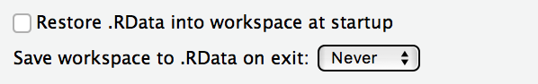
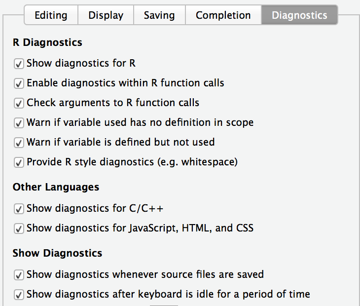
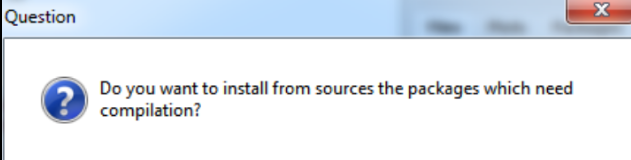

# Step by step installation instructions for windows

1. Если Windows только-только поставлена, то, пожалуйста,
создайте пользователя с логином английскими буквами и работайте из под него.

Например, имя пользователя "Mashenka" подходит, а "Машенька" не подходит.
Английское имя сильно облегчит жизнь в дальнейшем :)
Проблема в том, что при взаимодействии Rstudio - R могут возникать проблемы,
если в названии папки есть русские буквы, а у "Машеньки" путь к документам выглядит как "C:/Users/Машенька/".

Если компьютер давно используется с логином русскими буквами ("Машенька"), то оставляйте как есть, но:

    При установке внимательно следите, что все программы ставятся в папки не содержащие русских букв. Мы рекомендуем поставить R в папку `C:/R`, а Rstudio в папку `C:/Rstudio`.

2. Disable antivirus temporary for the setup procedure.

No, we don't want to instal a virus on your computer :)
Just we have encountered some problems during installation if anti-virus is active.

3. Install classic R for [windows](https://cran.r-project.org/bin/windows/base/).

Тем, кто уже знаком с R и **не боится повозиться самостоятельно**, мы советуем попробовать вместо классического R поставить MRO, [Microsoft R Open](https://mran.microsoft.com/open/).
Это другой дистрибутив R, оптимизированный под работу с 64-битными процессорами.
Всё полностью идентично, кроме двух нюансов: во-первых, MRO немного быстрее,
во-вторых, MRO ставит все пакеты на единую дату, выбираемую пользователем, а классический R ставит самые свежие версии пакетов.

4. Install [RStudio](https://www.rstudio.com/products/rstudio/download/#download).

Rstudio — is just a pretty graphical interface to R.
Brutal programmers may avoid Rstudio and use neovim or emacs :)
Do not confuse Rstudio and R-studio, which is a non-free program for data recovery.

5. Configure Rstudio.

Launch RStudio. Go to Tools — Global options.

In General section:

    * remove mark 'Restore .Rdata into workspace in startup'.
    * select `Never` in Save workspace to .Rdata on exit



In Sweave section:

    * select 'knitr' in 'Weave .Rnw files using'.


In Code - Diagnostics section:

    * выставьте все галочки.



6. Install fresh version of [Rtools](https://cran.r-project.org/bin/windows/Rtools/).

These are additional tools, that allow us, for example, to create excel files from R.

7. Шаг только для windows. Если имя пользователя windows набрано русскими буквами, а создавать нового никак не хочется!

7.1. Создайте папку для установки пакетов без русских букв и пробелов, например, `C:/Rlib`.

7.2. Выполните в консоли Rstudio команду
```{r, eval=FALSE}
system("setx R_LIBS C:/Rlib")
```

Вместо `C:/Rlib` должно быть имя папки созданной для установки пакетов.

7.3. Relaunch Rstudio

7.4. Проверьте, что R знает, куда ему ставить пакеты. Для этого выполните в консоли Rstudio команду

```{r, eval=FALSE}
.libPaths()
```

It should point to `C:/Rlib`. Now all R packages will install into `C:/Rlib`.


8. Install all required R packages for the course.

Download [install_all.R](https://github.com/bdemeshev/coursera_metrics/raw/master/install_all.R).
Open the file in RStudio (`File` --- `Open file`). Run it by selecting `Code` --- `Source with Echo`.
Internet connection is required for package installation.

You may encounter question: "Do you want to install from sources the packages which need compilation?"



You should answer "No"!

Explanation: некоторые пакеты содержат код C++ и для установки из исходников (source) требуют наличия и корректной настройки компилятора C++ на компьютере. При ответе "Нет" будут скачаны уже заранее скомпилированые пакеты.


Appearing red messages do not signify an error, a sign of an error is the explicit word "Error".

9. Do not forget to turn on the antivirus back :)


# Step by step installation instructions for macos

1. Install classic R for [macos](https://cran.r-project.org/bin/macosx/).

Тем, кто уже знаком с R и **не боится повозиться самостоятельно**, мы советуем попробовать вместо классического R поставить MRO, [Microsoft R Open](https://mran.microsoft.com/open/).
Это другой дистрибутив R, оптимизированный под работу с 64-битными процессорами.
Всё полностью идентично, кроме двух нюансов: во-первых, MRO немного быстрее,
во-вторых, MRO ставит все пакеты на единую дату, выбираемую пользователем, а классический R ставит самые свежие версии пакетов.

2. Install [RStudio](https://www.rstudio.com/products/rstudio/download/#download).

Rstudio — это всего лишь удобная красивая графическая оболочка к R.
Суровые брутальные программисты могут вполне обойтись и без Rstudio :)
Не спутайте Rstudio с R-studio, платной программой для восстановления данных.

3. Configure Rstudio.

Launch RStudio. Go to Tools --- Global options.

In General section:

    * remove mark 'Restore .Rdata into workspace in startup'.
    * select `Never` in Save workspace to .Rdata on exit


In Sweave section:

    * select 'knitr' in 'Weave .Rnw files using'.


In Code - Diagnostics section:

    * check all boxes.


4. In Rstudio console execute the command:

```{r, eval=FALSE}
system("defaults write org.R-project.R force.LANG en_US.UTF-8")
```

This will force the use of english language.

5. Install all required R packages for the course.


Скачайте файл [install_all.R](https://github.com/bdemeshev/coursera_metrics/raw/master/install_all.R).
Откройте его в RStudio (`File` --- `Open file`). Запустите, выбрав `Code` --- `Source with Echo`.
При этом требуется соединение с Интернетом.

При установке может встретиться вопрос: "Do you want to install from sources the packages which need compilation?"


You should answer "No"!

Причина: некоторые пакеты содержат код C++ и для установки из исходников (source) требуют наличия и корректной настройки компилятора C++ на компьютере. При ответе "Нет" будут скачаны уже заранее скомпилированые пакеты.


Appearing red messages do not signify an error, a sign of an error is the explicit word "Error".


# Some comments for linux

1. Under ubuntu Rstudio learns PATH value form the file `etc/environ`.
If PATH variable in this variable does not contain path to latex binary, Rstudio will not discover latex.
It is sufficient to add latex path in this file :)
